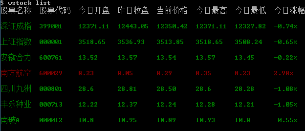

## wstock
 a cmd tool for watching stock

### install 
```bash
npm install wstock -g
```

### usage
- `wstock list`

 display all the stocks in stock.json and check status at intervals
 
 	- `wstock list -n`
	 
	 	do not mark the stock status red or green by its increase
 
 	- `wstock list -i <interval>`
	 
	 	set the stock code check interval

- `wstock show <code>`

 show stock status and and check it at intervals

 	- `wstock show <code> -n`
	 
	 	do not mark the stock status red or green by its increase
 
 	- `wstock show <code> -i <interval>`
	 
	 	set the stock code check interval
		 
 
- `wstock query <code|name>`

 query stock info by code or name

- `wstock add <code>`

 add stock to stock.json then u can use `wstock list` to display it's status
 
- `wstock remove <code>`

 remove stock from stock.json

### shortcut
